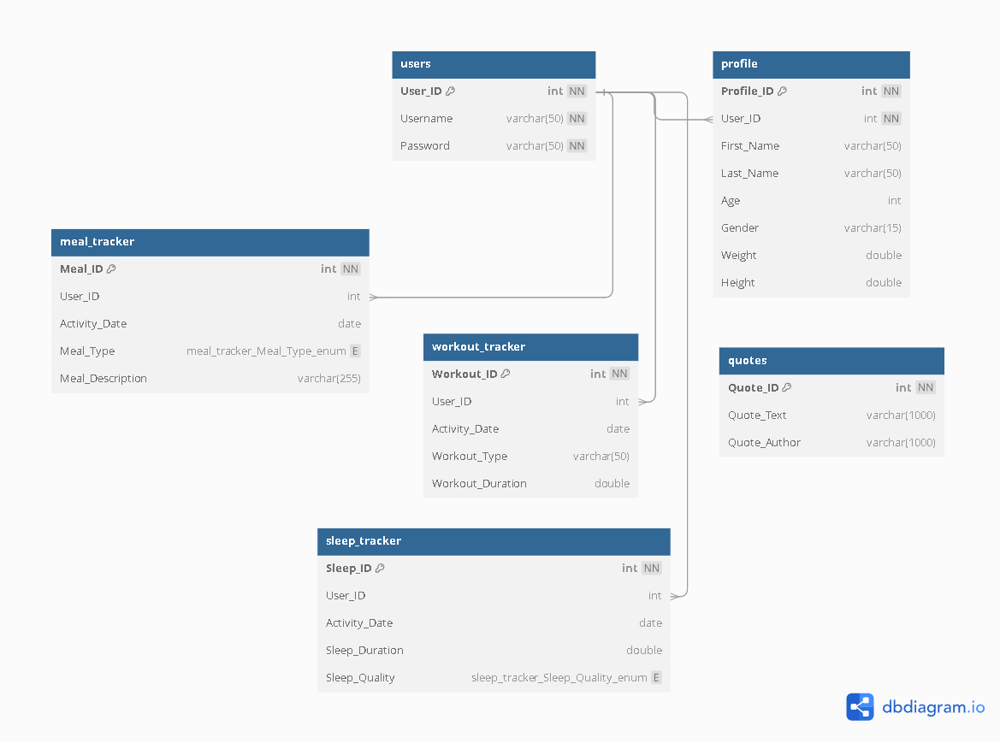

# Wellness Tracker\_DBMS

## Project Overview

The **Wellness Tracker** is a Java-based console application integrated with a MySQL database, designed to help users track and manage their overall wellness. The core focus of the project is its robust database integration, which ensures efficient storage and management of user data. By leveraging MySQL, the application enables seamless tracking of meals, workouts, and sleep patterns, providing a comprehensive health monitoring solution.

The database-focused design ensures data consistency, integrity, and scalability, making it a reliable tool for users aiming to improve their well-being. The application also supports Sustainable Development Goal 3 (SDG 3) by encouraging healthier lifestyle choices through effective data tracking.

---

## Table of Contents

- [Project Overview](#project-overview)
- [Key Features](#key-features)
- [Setting Up the Database](#setting-up-the-database)
- [File Structure](#file-structure)
- [Database Integration](#database-integration)
- [Notes](#notes)

---

## Key Features:

- **User Registration**: Allow users to register an account.
- **Profile Management**:
  - Create a profile with details such as name, age, gender, weight, and height.
  - Edit individual profile details.
  - Delete the profile, which logs the user out and allows profile creation upon the next login.
- **Dashboard**: Allow users to manage their profile and trackers.
- **Trackers**:
  - **Meal Tracker**: Allow users to view, add, and delete meals.
    -  Users can select the meal type as **"BREAKFAST"**, **"LUNCH"**, **"DINNER"**, or **"EXTRA"**.
    -  Users can input a description of the meal (string value).
  - **Workout Tracker**: Enable users to view, add, and delete workouts.
    -  Users can input the workout type.
    -  Users are prompted to enter the duration of the workout (in minutes).
  - **Sleep Tracker**: Allow users to view, add, and delete sleep logs.
    -  Users input the duration of sleep (in minutes).
    -  Users can select the sleep quality as **"BAD"**, **"DECENT"**, or **"GOOD"**.
- **Motivational Exit**: Displays an inspiring quote before exiting the program.

---

## Setting Up the Database

### Prerequisites:

1. Install **MySQL** and ensure it is running.
2. Install **Visual Studio Code (VS Code)** with the **Java Extension Pack**.
   - This includes:
     - **Language Support for Java(TM) by Red Hat**
     - **Debugger for Java**
     - **Maven for Java**
3. Clone or download the **WellnessTracker** repository, which contains all necessary files, including the database initialization script.

### Steps:

1. **Clone the repository**:

   ```bash
   git clone <https://github.com/your-repository-url/wellness-tracker.git>
   cd wellness-tracker
   ```

2. **Ensure MySQL is running**:

   - Start the MySQL service via your system’s service manager or command line.

3. **Run the program**:

   - Open the project folder in VS Code (File > Open Folder).
   - Navigate to `src/main/Main.java`.
   - Click the **Run** button at the top right of the editor or press **F5** to start the application.

### How it Works:

- Upon running `Main.java`, the program automatically initializes the database by executing the `init.sql` script located in the `db` folder. This script sets up all necessary tables and constraints for the application.
- The `WellnessDB` class handles database connection, creation, and initialization.
- If the database does not exist, the program creates it and imports the schema using the `init.sql` script.

[Back to Top](#project-overview)

---

## File Structure

```
WellnessTracker/
├── db/
│   ├── init.sql            # SQL script for database initialization
│   └── schema.png          # ER diagram of the database schema
├── src/
│   ├── main/
│   │   ├── Main.java       # Main program to be executed
│   │   └── WellnessDB.java # Handles database connection and initialization
│   ├── menu/
│   │   ├── HomeMenu.java
│   │   └── LoggedInMenu.java
│   ├── profile/
│   │   ├── Profile.java
│   │   ├── ProfileDAO.java
│   │   └── ProfileManager.java
│   ├── tracker/
│   │   ├── MealTracker.java
│   │   ├── SleepTracker.java
│   │   ├── TrackerDB.java
│   │   ├── TrackerManager.java
│   │   └── WorkoutTracker.java
│   ├── users/
│   │   ├── Users.java
│   │   └── UsersDAO.java
│   └── utils/
│       ├── Utility.java
│       └── WellnessQuotes.java
└── README.md
```

[Back to Top](#project-overview)

---

## Database Integration

The `init.sql` file in the `db` folder is executed during the first run of the program to:

1. Create the `WellnessDB` database.

2. Set up the following tables:

   - `users`
   - `profile`
   - `meal_tracker`
   - `workout_tracker`
   - `sleep_tracker`
   - `quotes`

3. Establish necessary foreign key relationships.

The schema is visualized in `schema.png` within the `db` folder:



[Back to Top](#project-overview)

---

## Notes

- **Database Configuration**: The database credentials (username and password) are hardcoded in `WellnessDB.java`. Update them as per your MySQL setup.
- **SQL Script**: Ensure `init.sql` is present in the `db` folder before running the application.
- **MySQL Service**: The program requires MySQL to be running to function correctly.

[Back to Top](#project-overview)

---
